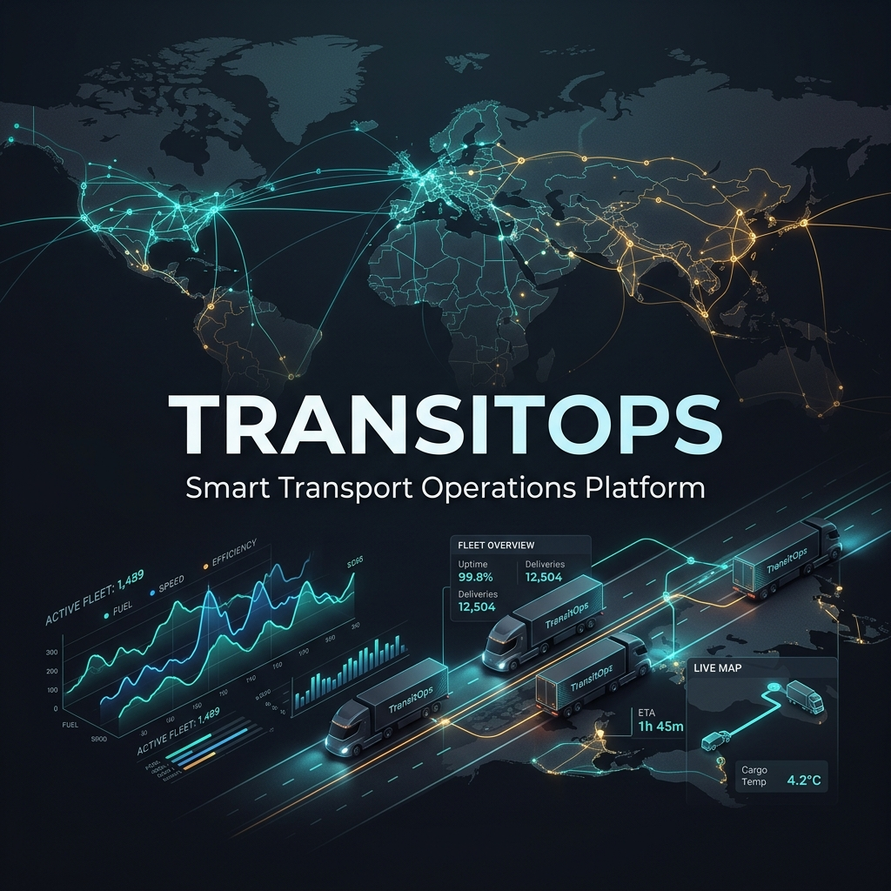
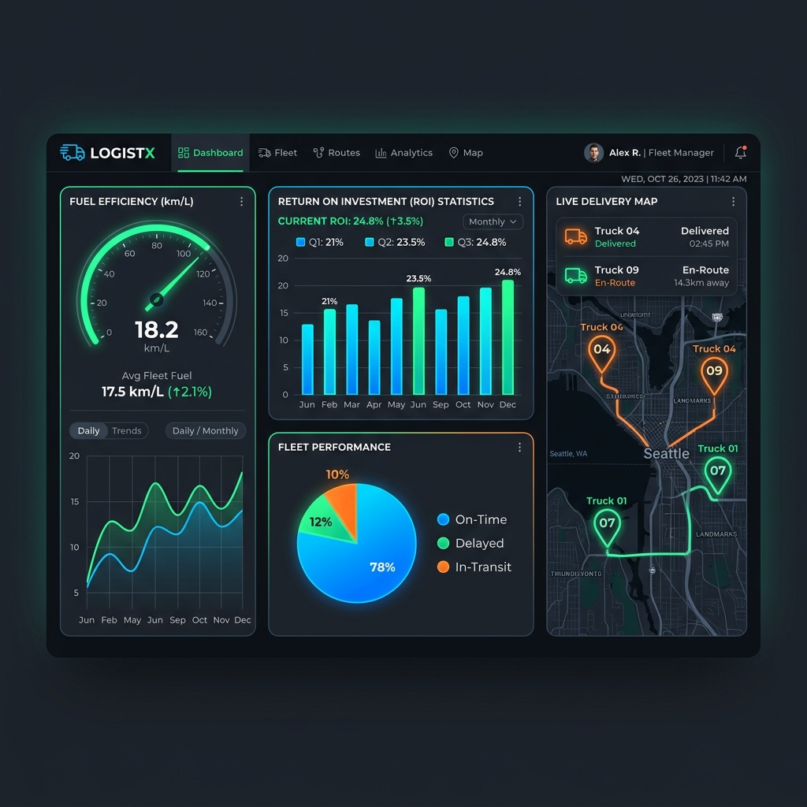
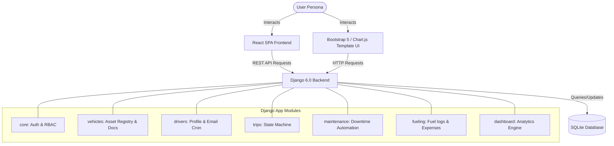
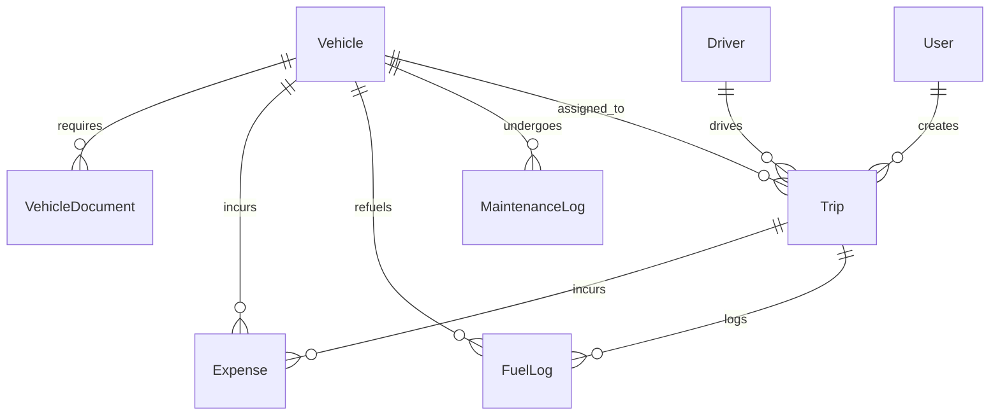
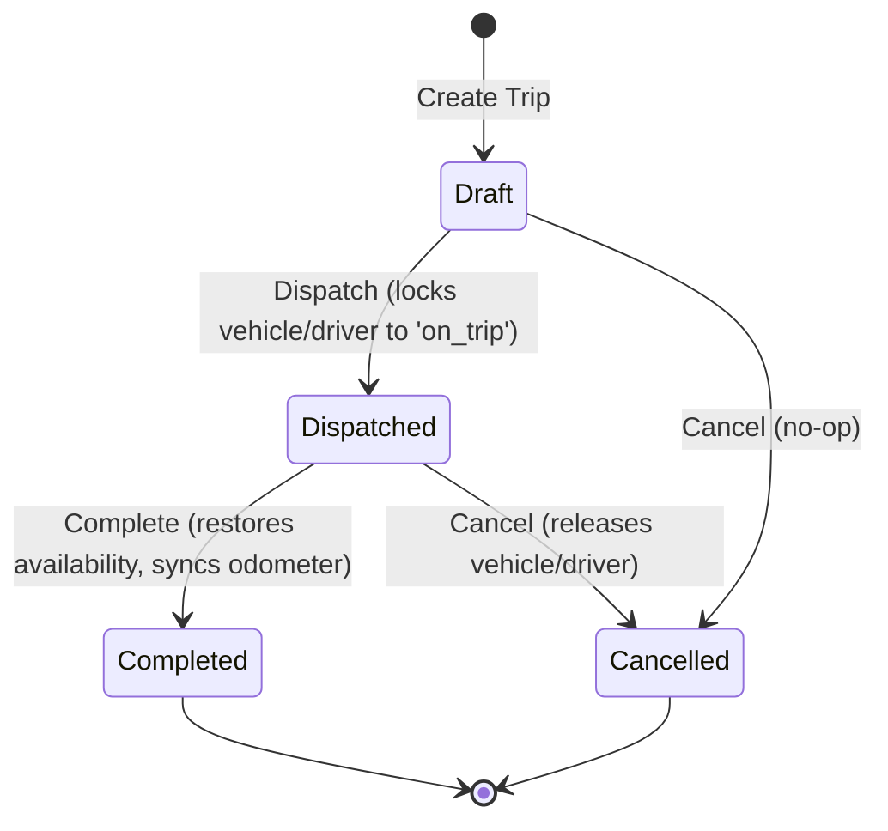

# TransitOps — Smart Transport Operations Platform

<p align="center">
  
</p>

<p align="center">
  
  
  
  
  
  
</p>

---

### 🌐 Live Production Deployment
**Frontend (Vite + React SPA on Vercel):** [https://transitops-frontend-taupe.vercel.app](https://transitops-frontend-taupe.vercel.app)

*Note: The frontend is configured with an automatic mock API fallback. If the local Django backend is not running, it automatically switches to a fully interactive localStorage database, making it 100% functional out-of-the-box on Vercel!*

---

## 🌟 Overview

> [!IMPORTANT]
> **TransitOps** is a centralized, enterprise-grade fleet management and transport operations platform. 
> Built for the Odoo Hackathon by team Quartz, it coordinates vehicles, compliance documentation, drivers, cargo dispatch missions, workshop maintenance schedules, and expense registries into a single system.

### Why TransitOps?
- **Operational Safety**: Built-in validators prevent dispatching overloaded vehicles or drivers with expired licenses.
- **Workflow Automation**: State machines automate status transitions for vehicles and drivers upon dispatch, completion, or maintenance closure.
- **Audit-Ready Compliance**: The Document Vault monitors critical records (RC, permits, PUC, insurance) and issues warning reminders.
- **Real-Time Intelligence**: Automatically calculates per-vehicle fuel efficiency (km/L), total operating costs, and ROI.

---

## 📸 Analytics & Dashboards

The reporting dashboard visualizes utilization rate trends, operational budgets, and financial return rates.

<p align="center">
  
</p>

---

## 🛠️ Architecture & Data Flow

TransitOps features a modular backend architecture alongside a decoupled React frontend workspace.



### Database Schema Relations



---

## 🔐 Role-Based Access Control (RBAC)

Access is strictly managed via role checks and conditional UI templates to ensure data security.

| Feature Area | Fleet Manager | Driver | Safety Officer | Financial Analyst |
| :--- | :---: | :---: | :---: | :---: |
| **Vehicles (CRUD)** | ✅ Full Access | 👁️ View Only | 👁️ View Only | 👁️ View Only |
| **Vehicle Documents (Upload/Delete)**| ✅ Full Access | ❌ No Access | ❌ No Access | ❌ No Access |
| **Drivers (CRUD / Edit)** | ✅ Full Access | 👁️ View Only | ✅ Edit Profiles | 👁️ View Only |
| **Drivers (Delete)** | ✅ Full Access | ❌ No Access | ❌ No Access | ❌ No Access |
| **Trips (Create/Dispatch/Complete)** | ✅ Full Access | ✅ Execute & Log | 👁️ View Only | 👁️ View Only |
| **Maintenance Logs (Add/Close)** | ✅ Full Access | 👁️ View Only | 👁️ View Only | 👁️ View Only |
| **Fueling & Expenses (Add)** | ✅ Full Access | 👁️ View Only | ❌ No Access | ✅ Add Logs |
| **Financial Reports & CSV Export** | ✅ Full Access | ❌ No Access | ❌ No Access | ✅ Full Access |

---

## ⚙️ Automated State Machine & Rules

### 1. Trip Lifecycle
Trips transition through `Draft` ➔ `Dispatched` ➔ `Completed` or `Cancelled` states:



### 2. Maintenance Lifecycle
Creating an **Active** maintenance log changes the vehicle status to `In Shop`. **Closing** the log returns the status to `Available` (unless the vehicle has been marked `Retired`).

---

## 📈 Fleet Intelligence Formulas

TransitOps tracks vehicle efficiency and financial performance using the following equations:

### 1. Per-Vehicle Fuel Efficiency
Measures the average distance covered per liter of fuel on completed runs:
$$\text{Fuel Efficiency (km/L)} = \frac{\sum \text{Actual Distance (km)}}{\sum \text{Fuel Consumed (L)}}$$

### 2. Operational Cost
Sums vehicle fueling and workshop maintenance charges:
$$\text{Operational Cost} = \text{Total Fuel Cost} + \text{Total Maintenance Cost}$$

### 3. Return on Investment (ROI)
Calculates the net profitability margin relative to the asset acquisition cost:
$$\text{ROI (\%)} = \frac{\text{Trips Revenue} - \text{Operational Cost}}{\text{Vehicle Acquisition Cost}} \times 100$$

---

## 🚀 Installation & Running

### Option A: Running the Backend (Django)

1.  **Clone the repository**:
    ```bash
    git clone https://github.com/amg-xai/transitops-hackathon.git
    cd transitops-hackathon
    ```

2.  **Initialize Virtual Environment**:
    ```bash
    python -m venv venv
    # Windows:
    .\venv\Scripts\Activate.ps1
    # Unix/macOS:
    source venv/bin/activate
    ```

3.  **Install dependencies**:
    ```bash
    pip install -r requirements.txt
    ```

4.  **Run Migrations & Seed Data**:
    ```bash
    python manage.py migrate
    python manage.py seed_demo
    ```

5.  **Start Development Server**:
    ```bash
    python manage.py runserver
    ```

---

### Option B: Running the Frontend (React SPA)

The repository includes a modern React single page application inside `folder_chrishna/`.

1.  **Navigate to the frontend directory**:
    ```bash
    cd folder_chrishna
    ```

2.  **Install node dependencies**:
    ```bash
    npm install
    ```

3.  **Run frontend dev server (Vite)**:
    ```bash
    npm run dev
    ```

---

## 👥 Demo Logins

All pre-seeded demo accounts share the password: **`demo1234`**

| Username | Role | Access Level |
|---|---|---|
| `fleet1` | Fleet Manager | Full administrative access across the platform |
| `driver1` | Driver | Authorized to schedule, dispatch, and complete runs |
| `safety1` | Safety Officer | Manages driver profiles, license expiry checks, and safety ratings |
| `finance1` | Financial Analyst | Records fueling, logs tolls/expenses, and views financial reports |

---

## 🧪 Tests Verification

Verify the platform's RBAC validation and business workflow logic by running the test suite:
```bash
python manage.py test
```